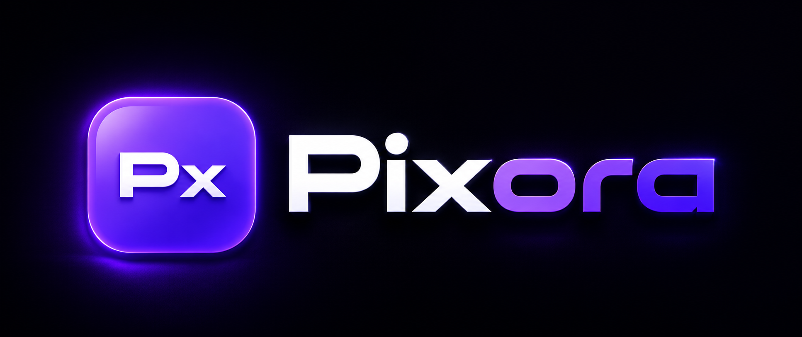

**The last image converter you'll ever need.**

Pixora is a Image Processing Suite, fully in-memory image conversion platform built for speed, privacy, and precision. No cloud. No disk writes. No tracking. Your files never leave your machine.

 

---

## What is Pixora?

Most image converters upload your files to a remote server, process them somewhere in the cloud, and hand them back — taking your data along for the ride. Pixora is architecturally different.

Every file you upload stays on your machine. The backend runs locally. The converted result is held in your browser's IndexedDB. After you download, Pixora wipes the entire session — zero residue, zero trace.

It converts every major image format with full control over dimensions, quality, metadata, and aspect ratio. It also ships a dedicated favicon generator that produces a complete ICO package — multi-size `.ico` plus six individual PNGs — from any image in one click.

---

## Format Support

| Format | Upload | Convert To |
|--------|:------:|:----------:|
| PNG | ✅ | ✅ |
| JPG / JPEG | ✅ | ✅ |
| WEBP | ✅ | ✅ |
| AVIF | ✅ | ✅ |
| HEIC / HEIF | ✅ | ✅ |
| BMP | ✅ | ✅ |
| TIFF | ✅ | ✅ |
| SVG | ✅ | ✅ |
| ICO | ✅ | ⛔ via `/ico` page only |
| GIF | ⛔ | ⛔ |
| Video / Audio | ⛔ | ⛔ |

---

## Conversion Settings

Every conversion is fully configurable — not just the format.

**Output Format** — choose from any supported target, source format excluded automatically. ICO never appears as an output option on the main page.

**Dimensions** — set width, height, or both. When aspect ratio is locked, changing one dimension auto-fills the other in real time.

**Preserve Aspect Ratio** — on by default, toggleable.

**Metadata** — choose to preserve or completely strip EXIF data, ICC profiles, and DPI information.

**Quality** — select 60, 70, 80, 90, or 100. Applied to JPEG, WEBP, and AVIF outputs.

---

## Favicon Generator

The `/ico` page is a dedicated favicon creation tool.

Upload any image — PNG, JPG, WEBP, AVIF, HEIC, BMP, TIFF, or SVG. Pixora generates a complete favicon package and delivers it as a single ZIP file containing:

- `favicon.ico` — multi-size ICO with all sizes embedded
- `icon_16x16.png` — browser tab
- `icon_32x32.png` — taskbar and bookmarks
- `icon_48x48.png` — Windows desktop shortcuts
- `icon_64x64.png` — high-DPI contexts
- `icon_128x128.png` — macOS Dock
- `icon_256x256.png` — Windows Explorer, high resolution

Drop `favicon.ico` into your project root. Done.

---

## The Backends

Pixora ships with two fully independent backends that are API-compatible. The frontend switches between them with a single environment variable — no code changes required.

### Python Backend

Built with **FastAPI** and **Pillow**. Handles every format including HEIC (via `pillow-heif`) and SVG (via `cairosvg`). Asynchronous, streaming, and entirely in-memory. Runs on port **8598**.

The Python backend exposes four API namespaces — `/api/validate`, `/api/convert`, `/api/metadata`, and `/api/ico/convert`. Every endpoint accepts multipart form data, processes the file in RAM, and streams the result back. Nothing is written to disk at any point in the pipeline.

AVIF and WEBP support full quality control. JPEG output supports optional EXIF passthrough. TIFF uses LZW compression. SVG is rasterized to a high-fidelity PNG intermediate before re-encoding to the target format.

### Rust Backend

Built with **Axum** and **image-rs**. Identical API surface to the Python backend — every route, every field, every response header matches exactly. The Rust backend is faster on raw throughput and uses significantly less memory per request. Runs on port **8599**.

Because both backends share the same API contract, you can run either one — or run both simultaneously and switch between them — without touching a single line of frontend code.

---

## Privacy Architecture

Pixora was designed from the ground up with a zero-persistence model.

**No server storage.** The backend never writes an uploaded file to disk. The converted result is never written to disk. No temporary files, no cache folders, no uploads directory.

**No cloud.** Both backends are local. Your files go from your browser to `localhost` and nowhere else.

**Session-scoped IndexedDB.** All file data in the browser lives in IndexedDB under the `PixoraDB` database. After a successful download, Pixora waits three seconds, deletes the entire database, clears all application state, and reloads. The session is gone.

**Format allowlist.** Only explicitly approved file extensions and MIME types pass validation. Everything else is rejected before processing begins.

**50 MB limit.** Enforced client-side and server-side.

---

## API Reference

### `POST /api/validate`

Validates an uploaded image without converting it. Returns format, dimensions, file size, and a validity flag.

### `POST /api/convert`

Converts an image. Accepts target format, optional width and height, aspect ratio lock, quality level, and metadata preference. Returns the converted image as a binary stream with output dimensions and size in response headers.

### `POST /api/ico/convert`

Converts any supported image into a ZIP favicon package containing `favicon.ico` and six individual PNG icons.

### `POST /api/metadata/extract`

Reads and returns available metadata from an image — EXIF fields, DPI, ICC profile presence, and color mode.

### `POST /api/metadata/strip`

Returns image bytes with all embedded metadata removed.

---

## Tech Stack

**Frontend** — Next.js 15, React 19, pure CSS with custom design tokens, IndexedDB for session storage, no UI library.

**Python Backend** — FastAPI, Uvicorn, Pillow, pillow-heif, cairosvg, piexif.

**Rust Backend** — Axum, Tokio, image-rs, zip-rs.

---

## Author

### Sambhav Dwivedi

Developer of **Pixora**.

Pixora is a modern, production-grade image conversion platform engineered with a focus on speed, reliability, scalability, and an exceptional user experience.

© 2026 Sambhav Dwivedi. All Rights Reserved.

See the `LICENSE` file for licensing terms and restrictions.

---

### Built for Speed. Engineered for Privacy. Designed for Precision.

**Pixora** — The professional Image Processing Suite.

